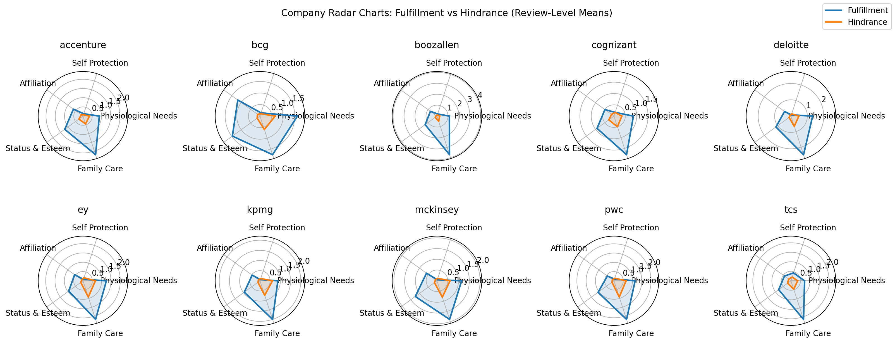
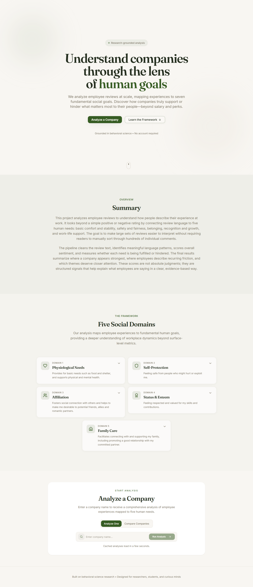
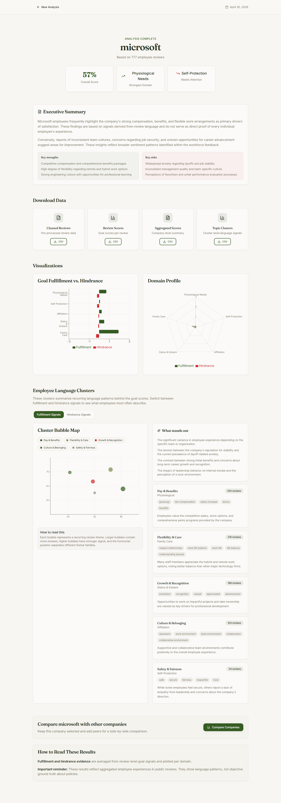
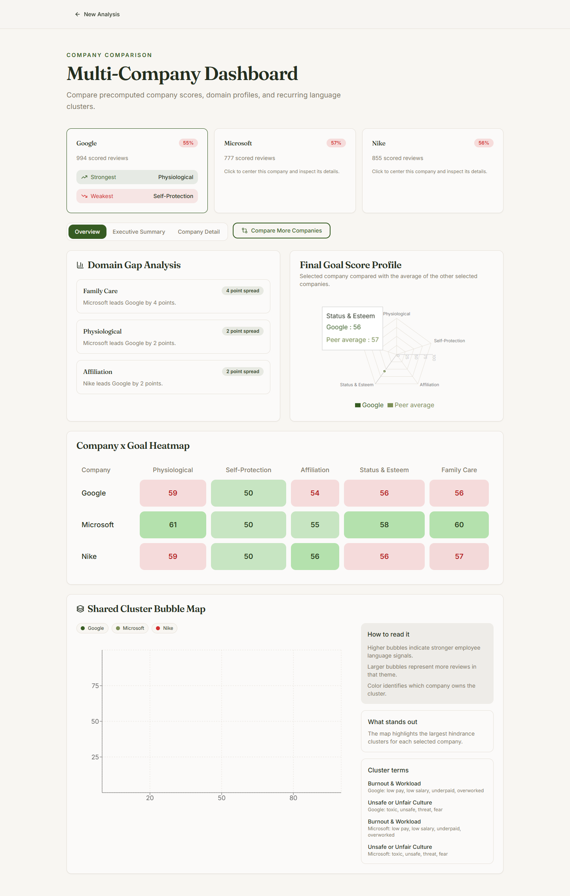

Glassdoor review scoring and workplace-intelligence pipeline: collect or load employee reviews, clean them, build text features, score sentiment plus five goal domains, precompute company score caches, generate RAG evidence packets, create Gemini-backed summaries on the free tier, and serve the results through a FastAPI backend and React dashboard.

## Repo map
- `pipeline.py` - default end-to-end runner for scrape/load, clean, extract, score, and visualization.
- `reviews_scraper.py` - legacy standalone scraper entrypoint; still used internally by `pipeline.py`.
- `data_cleaner.py` - legacy standalone cleaner; normalizes raw CSVs and keeps mostly US-located rows.
- `extraction.py` - legacy standalone feature builder; creates normalized text, tokens, TF-IDF matrix, and extraction config.
- `scorer.py` - legacy standalone scorer; computes sentiment and five goal-domain signals.
- `make_viz.py` - legacy standalone visualizer; creates static figures from scored outputs.
- `precompute_company_scores.py` - builds company-wise score caches from `review data/`.
- `generate_topic_artifacts.py` - creates topic cluster summaries and review-to-cluster assignments.
- `RAG_generation.py` - joins scored reviews, topic clusters, and raw review text into model-ready RAG evidence packets.
- `Gemini_RAG_generation.py` - calls the Gemini API free tier to generate cached summaries, cluster explanations, and insight text.
- `backend/` - FastAPI service for pipeline jobs, score caches, downloads, RAG artifacts, and local/hosted deployment.
- `frontend/` - React/Vite dashboard for single-company analysis, comparison mode, topic maps, and cached RAG summaries.
- `config/goal_dict.json` - five-domain fulfillment/hindrance lexicon.
- Data folders: `review data/`, `company scores/`, `features_exctract/`, `out/`, `runs/`, `server_jobs/`.

## Goal domains
The scoring model maps employee language to five workplace-need domains:
- `physiological` - pay, benefits, workload, comfort, and basic stability.
- `self_protection` - fairness, safety, trust, toxicity, retaliation, and job security.
- `affiliation` - belonging, collaboration, culture, and team connection.
- `status_esteem` - recognition, growth, promotion, feedback, and advancement.
- `family_care` - flexibility, work-life support, scheduling, and care obligations.

Each review receives sentiment, fulfillment, hindrance, and final goal-domain signals. Company summaries aggregate those signals into domain scores, topic clusters, radar/heatmap views, and evidence-backed natural-language explanations.

## Prerequisites
- Python 3.10+.
- Node.js 18+ for the frontend.
- Chrome/Chromium installed for scraping and optional screenshot capture.
- Recommended Python virtual environment:
  ```bash
  python -m venv .venv
  .venv\Scripts\activate
  ```
- Install Python dependencies as needed:
  ```bash
  pip install pandas numpy torch transformers tqdm matplotlib scikit-learn scipy unidecode spacy pydoll fastapi uvicorn google-genai
  python -m spacy download en_core_web_sm
  ```
- Install frontend dependencies:
  ```bash
  cd frontend
  npm install
  ```

The project uses the Gemini API free tier for cached RAG text generation. Configure the API key locally or in the deployment provider environment; do not expose it to frontend code.

## Quick start: local app
Run the backend:
```bash
.venv\Scripts\python.exe -m uvicorn backend.app:app --host 127.0.0.1 --port 8000
```

Run the frontend:
```bash
cd frontend
set VITE_API_BASE_URL=http://127.0.0.1:8000&& npm run dev -- --host 127.0.0.1 --port 8080
```

Open:
```text
http://127.0.0.1:8080/
```

Useful backend checks:
```bash
curl http://127.0.0.1:8000/api/health
curl http://127.0.0.1:8000/api/scored-companies
curl http://127.0.0.1:8000/api/scored-company/microsoft/rag
```

## Default pipeline workflow
`pipeline.py` is now the default operating entrypoint. It writes run-specific artifacts under `runs/` and can execute the full scrape-to-visualization flow or start from already downloaded review CSVs.

Full scrape/load pipeline:
```bash
.venv\Scripts\python.exe pipeline.py --job microsoft ^
  --url https://www.glassdoor.com/Reviews/Microsoft-Reviews-E1651.htm ^
  --pages 5 --region "United States" --headless
```

Run from an existing raw CSV and skip scraping:
```bash
.venv\Scripts\python.exe pipeline.py --job microsoft ^
  --skip-scrape --raw-csv "review data/microsoft/reviews.csv"
```

Run only through scoring and skip visualization:
```bash
.venv\Scripts\python.exe pipeline.py --job microsoft ^
  --skip-scrape --raw-csv "review data/microsoft/reviews.csv" --skip-viz
```

Append newly scraped reviews into `review data/{job}/reviews.csv`:
```bash
.venv\Scripts\python.exe pipeline.py --job microsoft ^
  --url https://www.glassdoor.com/Reviews/Microsoft-Reviews-E1651.htm ^
  --pages 3 --region "United States" --add --headless
```

Useful pipeline options:

| Flag | Purpose |
|---|---|
| `--job` | Company/job label used in run folder names and outputs. |
| `--url` | Glassdoor Reviews or Overview URL when scraping. |
| `--region` | Optional Glassdoor location filter, for example `United States`. |
| `--run-root` | Top-level folder for pipeline runs. |
| `--run-id` | Explicit run identifier; default is timestamp-based. |
| `--skip-scrape` | Start from `--raw-csv` instead of scraping. |
| `--raw-csv` | Raw review CSV path or glob. |
| `--skip-clean` | Reuse already cleaned data through `--clean-glob`. |
| `--skip-extract` | Reuse an existing feature directory through `--features-dir`. |
| `--skip-score` | Reuse an existing scored output directory through `--scored-out-dir`. |
| `--skip-viz` | Skip static figure generation. |
| `--scrape-only` | Collect reviews only. |
| `--add` | Merge scraped reviews into `review data/{job}/reviews.csv`. |
| `--pages`, `--start-page`, `--end-page` | Control Glassdoor pagination. |
| `--page-delay` | Delay between scraped pages. |
| `--headless` | Run Chrome without a visible browser window. |
| `--keep-intermediate` | Keep intermediate run artifacts. |
| `--compress-artifacts` | Gzip run artifacts for storage. |

## Legacy script workflow
The older separate scripts still work and are useful for debugging individual stages, but they are no longer the preferred run structure:
```bash
python reviews_scraper.py ...
python data_cleaner.py
python extraction.py --in "cleaned_US/reviews_*.csv" --out features_exctract
python scorer.py
python make_viz.py --company_csv out/company_scores.csv --review_csv out/review_scores.csv
```

Use these only when isolating a specific stage. For normal runs, use `pipeline.py`.

## Company score cache
The deployed dashboard uses precomputed company-wise caches so users do not wait for the full scoring pipeline on a single-CPU host.

Generate one company:
```bash
.venv\Scripts\python.exe precompute_company_scores.py --company microsoft
```

Generate all companies from `review data/`:
```bash
.venv\Scripts\python.exe precompute_company_scores.py
```

Generate topic artifacts from scored reviews:
```bash
.venv\Scripts\python.exe generate_topic_artifacts.py
```

The cache layout is:
```text
company scores/{company}/
  company_scores.csv
  review_scores.csv
  cleaned_reviews.csv
  topic_summary.csv
  topic_assignments.csv
  per_company/{company}.csv
```

## RAG artifact generation
Stage one builds evidence packets without calling a model:
```bash
.venv\Scripts\python.exe RAG_generation.py --company microsoft
.venv\Scripts\python.exe RAG_generation.py
```

Outputs:
```text
company scores/{company}/rag_evidence.json
company scores/{company}/rag_profile.json
```

Stage two calls Gemini and caches generated language:
```bash
.venv\Scripts\python.exe Gemini_RAG_generation.py --company microsoft --force
.venv\Scripts\python.exe Gemini_RAG_generation.py --force
```

Outputs:
```text
company scores/{company}/rag_summary.json
company scores/{company}/rag_clusters.json
company scores/{company}/rag_insights.json
```

These files power the single-company executive summary, key strengths, key risks, per-cluster descriptions, and "what stands out" section. Gemini is used during pre-cache generation so the Render backend can serve cached JSON instantly.

## Backend API surface
- `GET /api/health` - service health and queue metadata.
- `GET /api/companies` - raw review-data folders.
- `GET /api/scored-companies` - companies with precomputed score caches.
- `GET /api/scored-company/{company_id}/outputs` - list downloadable cache files.
- `GET /api/scored-company/{company_id}/download?path=...` - download cache artifacts.
- `GET /api/scored-company/{company_id}/rag` - cached RAG summary, cluster, insight, evidence, and profile payloads.
- `POST /api/run` - queue a cache-mode pipeline job when a precomputed cache is unavailable.
- `GET /api/job/{job_id}` - job status.
- `GET /api/job/{job_id}/outputs` - generated job outputs.
- `GET /api/job/{job_id}/download?path=...` - download job artifacts.

## Frontend application
The React dashboard supports:
- Single-company analysis from the landing page.
- Company comparison from the landing page.
- Compare-from-results flow for a selected company.
- Cached executive summaries from RAG artifacts.
- Goal-domain cards, bar/radar charts, topic bubble maps, and cluster explanation cards.
- Comparison heatmap, domain gap analysis, final goal score profile, shared cluster map, and company detail view.
- Download links for cleaned reviews, review scores, aggregated scores, and topic clusters.

Cached analyses intentionally show a short loading buffer so the user sees the same processing state as full pipeline runs.

## Results and generated data
The current cached dataset contains 50 precomputed companies. Each company can include:
- one company-level score row with overall sentiment, positive/negative share, confidence interval fields, and five final goal-domain scores;
- hundreds to 1,000 per-review score rows depending on the company input file;
- 10 topic clusters: five fulfillment clusters and five hindrance clusters;
- representative evidence snippets for each cluster;
- Gemini-generated executive summary, strengths, risks, cluster explanations, and "what stands out" observations.

Core scored outputs:
- `review_scores.csv` - per-review sentiment and goal signals.
- `company_scores.csv` - company-level aggregate metrics.
- `topic_summary.csv` - cluster-level language signals, counts, terms, and map coordinates.
- `topic_assignments.csv` - review-to-cluster assignments.
- `rag_evidence.json` - compact evidence packets for model generation.
- `rag_profile.json` - company-level RAG profile.
- `rag_summary.json` - executive summary, strengths, risks, and domain explanations.
- `rag_clusters.json` - cluster summaries.
- `rag_insights.json` - "what stands out" observations.

Optional static figures and current frontend captures live under `out/figures/`:









## Notes and defaults
- `company scores/` is designed for deployable cache artifacts; report/log files are not required for serving the dashboard.
- `local_compare_outputs/`, `server_jobs/`, and `runs/` are local runtime folders and should stay ignored.
- The scoring pipeline can run on CPU; precomputing company scores keeps Render deployment practical.
- Gemini text should be cached before deployment where possible. Live model calls should be reserved for user-selected comparisons or future employee-to-company matching flows.
