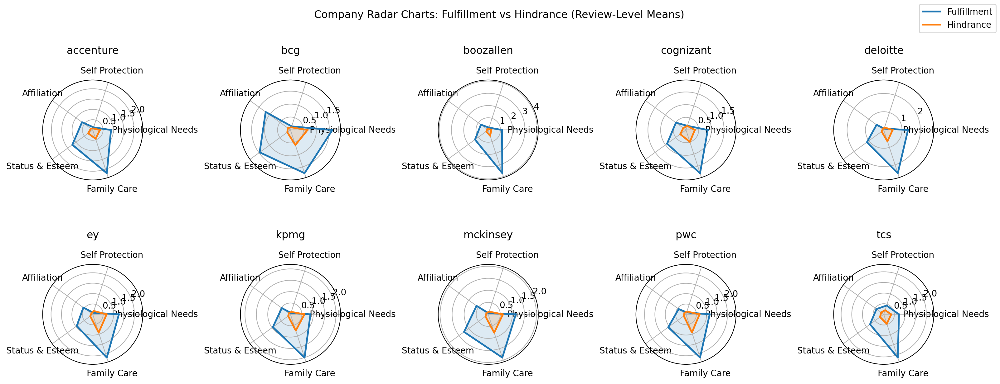
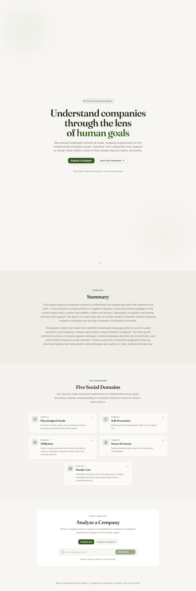
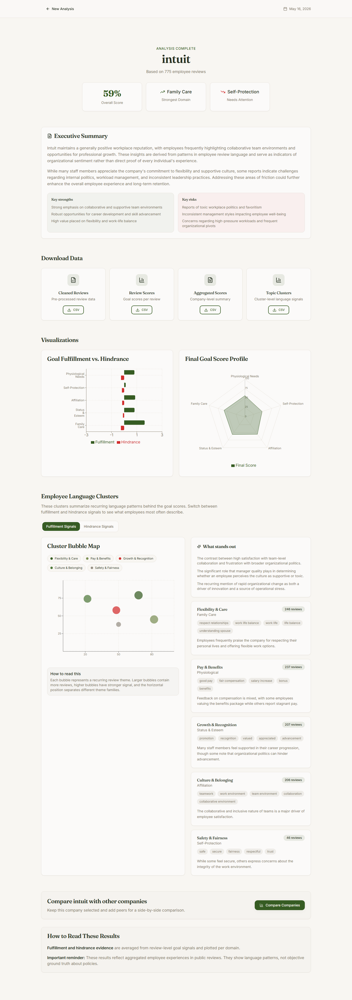
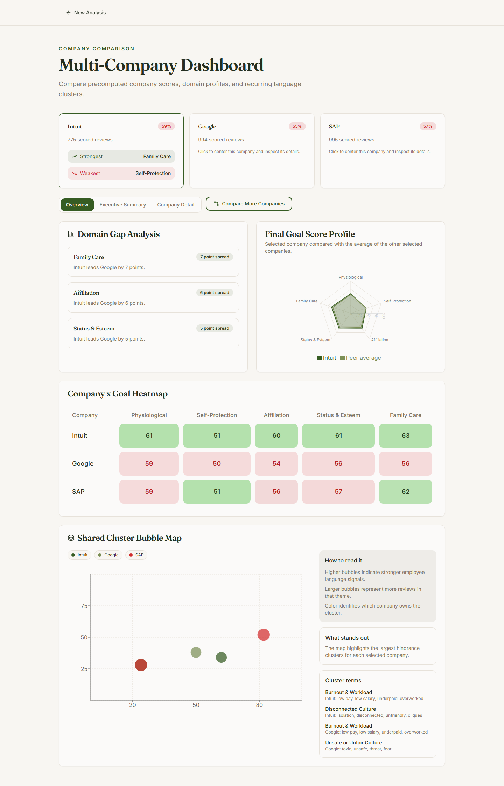

Glassdoor review scoring and workplace-intelligence pipeline: collect or load employee reviews, clean them, build text features, score sentiment plus five goal domains, precompute company score caches, generate RAG evidence packets, create Gemini-backed summaries on the free tier, serve the results through a FastAPI backend and React dashboard, and run behavioral employee-to-company matching against cached company evidence.

## Repo map
- `pipeline.py` - default end-to-end runner for scrape/load, clean, extract, score, visualization, deployable score cache, topic artifacts, RAG evidence, and cached Gemini summaries.
- `reviews_scraper.py` - legacy standalone scraper entrypoint; still used internally by `pipeline.py`.
- `data_cleaner.py` - legacy standalone cleaner; normalizes raw CSVs and keeps mostly US-located rows.
- `extraction.py` - legacy standalone feature builder; creates normalized text, tokens, TF-IDF matrix, and extraction config.
- `scorer.py` - legacy standalone scorer; computes sentiment and five goal-domain signals.
- `make_viz.py` - legacy standalone visualizer; creates static figures from scored outputs.
- `precompute_company_scores.py` - builds company-wise score caches from `review data/`.
- `generate_topic_artifacts.py` - creates topic cluster summaries and review-to-cluster assignments.
- `RAG_generation.py` - joins scored reviews, topic clusters, and raw review text into model-ready RAG evidence packets.
- `Gemini_RAG_generation.py` - calls the Gemini API free tier to generate cached summaries, cluster explanations, and insight text.
- `backend/` - FastAPI service for pipeline jobs, score caches, downloads, RAG artifacts, match interpretation, and local/hosted deployment.
- `frontend/` - React/Vite dashboard for single-company analysis, comparison mode, topic maps, cached RAG summaries, and employee-to-company matching.
- `config/goal_dict.json` - five-domain fulfillment/hindrance lexicon.
- Data folders: `review data/`, `company scores/`, `features_exctract/`, `out/`, `runs/`, `server_jobs/`.

## Goal domains
The scoring model maps employee language to five workplace-need domains:
- `physiological` - pay, benefits, workload, comfort, and basic stability.
- `self_protection` - fairness, safety, trust, toxicity, retaliation, and job security.
- `affiliation` - belonging, collaboration, culture, and team connection.
- `status_esteem` - recognition, growth, promotion, feedback, and advancement.
- `family_care` - flexibility, work-life support, scheduling, and care obligations.

Each review receives sentiment, fulfillment, hindrance, and final goal-domain signals. Company summaries aggregate those signals into domain scores, topic clusters, radar/heatmap views, and evidence-backed natural-language explanations.

## Behavioral matching
The matching flow is behavioral fit, not ATS ranking. It does not match a resume to a job description. It takes a user's workplace narrative and selected goal/tradeoff preferences, builds a behavioral profile across the five goal domains, and compares that profile against review-derived company evidence.

The matching stack uses two layers:
- Local deterministic scoring maps the user's text and selected tradeoffs to domain weights, desired themes, risk sensitivities, and confidence signals using the goal dictionary and matching heuristics.
- Optional Gemini interpretation turns the same input into a psychology-oriented profile, top-match explanation, and evidence-backed fit summary. If the model call is unavailable, the frontend keeps using the local profile and cached review evidence.

Company fit is scored from cached artifacts: final goal-domain scores, review-level evidence, topic clusters, RAG packets, theme overlap, risk penalties, and confidence from the amount and consistency of evidence. Match results show the top four companies, the user's behavior profile, the top-match reasoning, an interactive score explanation, a confidence meter, tradeoff comparisons, contextual review evidence, and "why not these companies" explanations.

## Prerequisites
- Python 3.10+.
- Node.js 18+ for the frontend.
- Chrome/Chromium installed for scraping and optional screenshot capture.
- Recommended Python virtual environment:
  ```bash
  python -m venv .venv
  .venv\Scripts\activate
  ```
- Install Python dependencies as needed:
  ```bash
  pip install pandas numpy torch transformers tqdm matplotlib scikit-learn scipy unidecode spacy pydoll fastapi uvicorn google-genai
  python -m spacy download en_core_web_sm
  ```
- Install frontend dependencies:
  ```bash
  cd frontend
  npm install
  ```

The project uses the Gemini API free tier for cached RAG text generation. Configure the API key locally or in the deployment provider environment; do not expose it to frontend code.

## Quick start: local app
Run the backend:
```bash
.venv\Scripts\python.exe -m uvicorn backend.app:app --host 127.0.0.1 --port 8000
```

Run the frontend:
```bash
cd frontend
set VITE_API_BASE_URL=http://127.0.0.1:8000&& npm run dev -- --host 127.0.0.1 --port 8080
```

Open:
```text
http://127.0.0.1:8080/
```

Useful backend checks:
```bash
curl http://127.0.0.1:8000/api/health
curl http://127.0.0.1:8000/api/scored-companies
curl http://127.0.0.1:8000/api/scored-company/microsoft/rag
```

The frontend uses the same cached company endpoints for both company analysis and matching. Match profile generation can call the backend model endpoint when configured, then falls back to local scoring if no model response is available.

## Default pipeline workflow
`pipeline.py` is now the default operating entrypoint. It writes run-specific artifacts under `runs/` and, after scoring, publishes the company cache used by the dashboard under `company scores/{company}/`. A normal run now ends with cached score files, topic artifacts, RAG evidence/profile JSON, and Gemini-generated summary/cluster/insight JSON when a Gemini API key is available.

Full scrape/load pipeline:
```bash
.venv\Scripts\python.exe pipeline.py --job microsoft ^
  --url https://www.glassdoor.com/Reviews/Microsoft-Reviews-E1651.htm ^
  --pages 5 --region "United States" --headless
```

That command performs the full sequence:
```text
scrape -> clean -> extract -> score -> visualize -> cache scores -> generate topics -> build RAG evidence -> generate Gemini RAG text
```

Run from an existing raw CSV and skip scraping:
```bash
.venv\Scripts\python.exe pipeline.py --job microsoft ^
  --skip-scrape --raw-csv "review data/microsoft/reviews.csv"
```

Run only through scoring and skip visualization:
```bash
.venv\Scripts\python.exe pipeline.py --job microsoft ^
  --skip-scrape --raw-csv "review data/microsoft/reviews.csv" --skip-viz
```

Rebuild a company cache and force fresh Gemini text:
```bash
.venv\Scripts\python.exe pipeline.py --job microsoft ^
  --skip-scrape --raw-csv "review data/microsoft/reviews.csv" ^
  --skip-viz --gemini-force
```

Append newly scraped reviews into `review data/{job}/reviews.csv`:
```bash
.venv\Scripts\python.exe pipeline.py --job microsoft ^
  --url https://www.glassdoor.com/Reviews/Microsoft-Reviews-E1651.htm ^
  --pages 3 --region "United States" --add --headless
```

Useful pipeline options:

| Flag | Purpose |
|---|---|
| `--job` | Company/job label used in run folder names and outputs. |
| `--url` | Glassdoor Reviews or Overview URL when scraping. |
| `--region` | Optional Glassdoor location filter, for example `United States`. |
| `--run-root` | Top-level folder for pipeline runs. |
| `--run-id` | Explicit run identifier; default is timestamp-based. |
| `--skip-scrape` | Start from `--raw-csv` instead of scraping. |
| `--raw-csv` | Raw review CSV path or glob. |
| `--skip-clean` | Reuse already cleaned data through `--clean-glob`. |
| `--skip-extract` | Reuse an existing feature directory through `--features-dir`. |
| `--skip-score` | Reuse an existing scored output directory through `--scored-out-dir`. |
| `--skip-viz` | Skip static figure generation. |
| `--skip-cache` | Skip score-cache publishing and all downstream topic/RAG work. |
| `--skip-topic-artifacts` | Skip `topic_summary.csv` and `topic_assignments.csv` generation. |
| `--skip-rag` | Skip `rag_evidence.json` and `rag_profile.json` generation. |
| `--skip-gemini-rag` | Skip Gemini-generated cached language files. |
| `--score-cache-root` | Root folder for deployable company score caches. |
| `--review-cache-root` | Root folder for source reviews used by RAG evidence generation. |
| `--rag-max-evidence` | Maximum representative review snippets per topic cluster. |
| `--gemini-force` | Regenerate Gemini RAG files even if cached JSON already exists. |
| `--scrape-only` | Collect reviews only. |
| `--add` | Merge scraped reviews into `review data/{job}/reviews.csv`. |
| `--pages`, `--start-page`, `--end-page` | Control Glassdoor pagination. |
| `--page-delay` | Delay between scraped pages. |
| `--headless` | Run Chrome without a visible browser window. |
| `--keep-intermediate` | Keep intermediate run artifacts. |
| `--compress-artifacts` | Gzip run artifacts for storage. |

## Legacy script workflow
The older separate scripts still work and are useful for debugging individual stages, but they are no longer the preferred run structure:
```bash
python reviews_scraper.py ...
python data_cleaner.py
python extraction.py --in "cleaned_US/reviews_*.csv" --out features_exctract
python scorer.py
python make_viz.py --company_csv out/company_scores.csv --review_csv out/review_scores.csv
```

Use these only when isolating a specific stage. For normal runs, use `pipeline.py`.

## Company score cache
The deployed dashboard uses company-wise caches so users do not wait for the full scoring pipeline on a single-CPU host. `pipeline.py` now creates or refreshes this cache automatically after a successful score stage.

Generate one company:
```bash
.venv\Scripts\python.exe pipeline.py --job microsoft ^
  --skip-scrape --raw-csv "review data/microsoft/reviews.csv" --skip-viz
```

Generate all companies from `review data/`:
```bash
.venv\Scripts\python.exe precompute_company_scores.py
```

`precompute_company_scores.py` remains available for bulk rebuilds across the existing `review data/` folder. For a newly scraped company, use `pipeline.py` so the score cache and RAG cache are generated together.

The cache layout is:
```text
company scores/{company}/
  company_scores.csv
  review_scores.csv
  cleaned_reviews.csv
  topic_summary.csv
  topic_assignments.csv
  rag_evidence.json
  rag_profile.json
  rag_summary.json
  rag_clusters.json
  rag_insights.json
  per_company/{company}.csv
```

## RAG artifact generation
Stage one builds evidence packets without calling a model:
```bash
.venv\Scripts\python.exe RAG_generation.py --company microsoft
.venv\Scripts\python.exe RAG_generation.py
```

Outputs:
```text
company scores/{company}/rag_evidence.json
company scores/{company}/rag_profile.json
```

Stage two calls Gemini and caches generated language:
```bash
.venv\Scripts\python.exe Gemini_RAG_generation.py --company microsoft --force
.venv\Scripts\python.exe Gemini_RAG_generation.py --force
```

Outputs:
```text
company scores/{company}/rag_summary.json
company scores/{company}/rag_clusters.json
company scores/{company}/rag_insights.json
```

These files power the single-company executive summary, key strengths, key risks, per-cluster descriptions, and "what stands out" section. Gemini is used during pre-cache generation so the Render backend can serve cached JSON instantly.

For normal operation, these RAG commands do not need to be run manually. `pipeline.py` calls the topic generator, `RAG_generation.py`, and `Gemini_RAG_generation.py` after the score cache is published. Manual calls are mostly useful when regenerating only one layer of cached artifacts.

## Backend API surface
- `GET /api/health` - service health and queue metadata.
- `GET /api/companies` - raw review-data folders.
- `GET /api/scored-companies` - companies with precomputed score caches.
- `GET /api/scored-company/{company_id}/outputs` - list downloadable cache files.
- `GET /api/scored-company/{company_id}/download?path=...` - download cache artifacts.
- `GET /api/scored-company/{company_id}/rag` - cached RAG summary, cluster, insight, evidence, and profile payloads.
- `POST /api/match/profile` - interpret a user workplace narrative, selected goals, and tradeoffs into a behavioral match profile.
- `POST /api/match/top-summary` - generate an evidence-backed explanation for why the highest-ranked company fits the user's profile.

## Matching data flow
The matching flow is designed to reuse the same cache files as the analysis dashboard:
```text
user narrative + goal/tradeoff buttons
  -> local profile and optional Gemini profile interpretation
  -> company score-cache comparison
  -> RAG/review evidence attachment
  -> top-four overview and selected-company fit detail
```

The profile layer tracks domain weights, desired themes, avoid themes, risk sensitivities, likely motivators, and confidence. The company layer tracks match score, domain alignment, theme bonus, risk penalty, evidence confidence, review snippets, tradeoff comparisons, and selected-company explanations.

## Frontend application
The React dashboard supports:
- Single-company analysis from the landing page.
- Company comparison from the landing page.
- Match Yourself flow from the landing page.
- Single-company "Show My Match" flow that sends the user to a separate match-input page.
- Comparison-dashboard matching for all compared companies or for the currently selected company.
- Compare-from-results flow for a selected company.
- Cached executive summaries from RAG artifacts.
- Goal-domain cards, bar/radar charts, topic bubble maps, and cluster explanation cards.
- Comparison heatmap, domain gap analysis, final goal score profile, shared cluster map, and company detail view.
- Match overview with ranked company cards, behavior profile, top-match explanation, confidence meter, interactive score explanation, contextual review evidence, tradeoff graphics, and "why not these companies" explanations.
- Download links for cleaned reviews, review scores, aggregated scores, and topic clusters.

Cached analyses intentionally show a short loading buffer before rendering results.

## Results and generated data
The current cached dataset contains 50 precomputed companies. Each company can include:
- one company-level score row with overall sentiment, positive/negative share, confidence interval fields, and five final goal-domain scores;
- hundreds to 1,000 per-review score rows depending on the company input file;
- 10 topic clusters: five fulfillment clusters and five hindrance clusters;
- representative evidence snippets for each cluster;
- Gemini-generated executive summary, strengths, risks, cluster explanations, and "what stands out" observations.

The same review evidence is reused by both analysis and matching. Single-company pages show evidence below the clusters, while match pages use contextual highlighted sentences to explain why a company supports or conflicts with the user's stated needs.

Core scored outputs:
- `review_scores.csv` - per-review sentiment and goal signals.
- `company_scores.csv` - company-level aggregate metrics.
- `topic_summary.csv` - cluster-level language signals, counts, terms, and map coordinates.
- `topic_assignments.csv` - review-to-cluster assignments.
- `rag_evidence.json` - compact evidence packets for model generation.
- `rag_profile.json` - company-level RAG profile.
- `rag_summary.json` - executive summary, strengths, risks, and domain explanations.
- `rag_clusters.json` - cluster summaries.
- `rag_insights.json` - "what stands out" observations.

Match reports are generated at runtime from these cached score and RAG artifacts. They are not currently saved as persistent report files.

Optional static figures and current frontend captures live under `out/figures/`:









## Notes and defaults
- `company scores/` is designed for deployable cache artifacts; report/log files are not required for serving the dashboard.
- `local_compare_outputs/`, `server_jobs/`, and `runs/` are local runtime folders and should stay ignored.
- The scoring pipeline can run on CPU; precomputing company scores keeps Render deployment practical.
- Gemini text should be cached before deployment where possible. Live model calls are currently reserved for user-selected comparisons, match profile interpretation, and top-match explanations.
- Matching is a behavioral evidence fit estimate. It should be presented as decision support, not as hiring eligibility, employee screening, or a definitive workplace outcome prediction.
